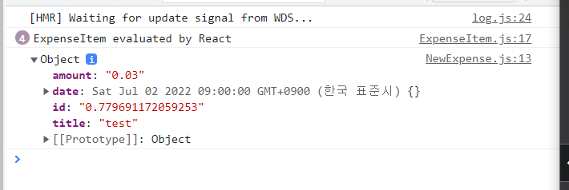
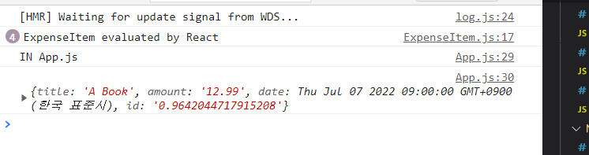
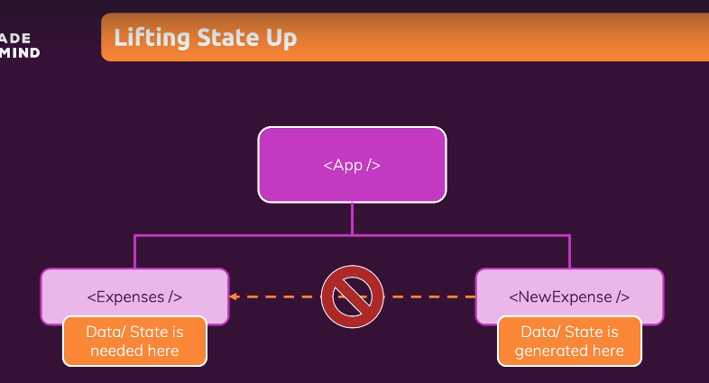
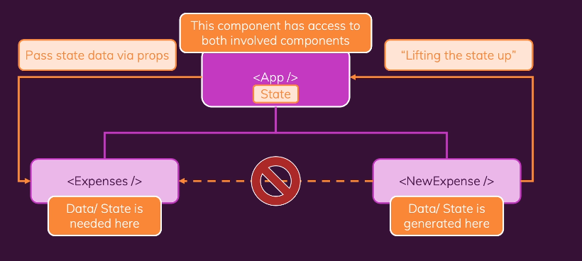

# Two-way Binding(양방향 바인딩)

- 변경되는 입력값만 수신하는 것이 아니라, 입력에 새로운 값을 다시 전달할 수 있음

- 프로그램에 따라 입력값을 재설정하거나 입력할 수 있음

- 즉, 상태를 수신 + 입력에 상태를 다시 보내줌, 상태를 변경하면 입력도 변함

- 기본 속성인 value를 입력 속성에 추가하기만 하면 됨 = 모든 입력 요소들이 갖는 내부 값의 프로퍼티를 설정 -> 새로운 값으로 설정

- 폼이 전송되고 난 후 사용자가 입력했던 것을 오버라이드, 입력 부분이 깔끔하게 지워짐

  ```javascript
  import React, { useState } from 'react';
  
  import './ExpenseForm.css';
  
  const ExpenseForm = () => {
    // document.getElementById('').addEventListener('click', (event) => {});
  
    const [enteredTitle, setEnteredTitle] = useState('');
    const [enteredAmount, setEnteredAmount] = useState('');
    const [enteredDate, setEnteredDate] = useState('');
  
    // const [userInput, setUserInput] = useState({
    //   enteredTitle: '',
    //   enteredAmount: '',
    //   enteredDate: '',
    // });
  
    const titleChangeHandler = (event) => {
      // 입력할 때마다 출력됨(입력하는 중에 계속)
      // console.log(event.target.value);
      // 1.
      setEnteredTitle(event.target.value);
      // 2.
      // setUserInput({
      //   // 스프레드 후
      //   ...userInput,
      //   // 오버라이딩
      //   enteredTitle: event.target.value,
      //   // 이 경우 우리는 이전의 state를 따라 상태를 업데이트함
      //   // 다른 값을 복사해서 잃어버리지 않도록 하는 방법
      //   // 기존 값을 복사하기 위해 기존 state의 스냅샷에 의존하고,
      //   // 오버라이드함 - 이전 state에 의존
      //   // 상태를 업데이트하기 위한 함수로 전달할 것
      // });
      // 3.
      // 이전 state의 스냅샷을 얻어서 새로운 state의 스냅샷 반환
      // 많은 경우에 위와 함께 두 방법 다 괜찮으나,
      // 동시에 수많은 상태 업데이트를 계획한다면
      // 오래되었거나 잘못된 상태 스냅샷에 의존할 수 있음(위의 방식은)
      // 그래서 아래의 접근 방법 사용
      // 아래는 이 안에 있는 함수에서 이 상태 스탭샷이 가장 최신의 것으로 인지,
      // 항상 계획된 상태 업데이트를 염두에 두고 있다는 것을 보장
      // 좀 더 안전한 방법임
      // setUserInput((prevState) => {
      //   return { ...prevState, enteredTitle: event.target.value };
      // });
    };
  
    const amountChangeHandler = (event) => {
      // 1.
      setEnteredAmount(event.target.value);
  
      // 2.
      // setUserInput({
      //   ...userInput,
      //   enteredAmount: event.target.value,
      // });
  
      // 3.
      // setUserInput((prevState) => {
      //   return { ...prevState, enteredAmount: event.target.value };
      // });
    };
  
    const dateChangeHandler = (event) => {
      // 1.
      setEnteredDate(event.target.value);
      // 2.
      // setUserInput({
      //   ...userInput,
      //   enteredDate: event.target.value,
      // });
      // 3.
      // setUserInput((prevState) => {
      //   return { ...prevState, enteredDate: event.target.value };
      // });
    };
    // 페이지가 다시 로드됨 - 자바스크립트와 수동으로 결합해서 무언갈 해야 함
    const submitHandler = (event) => {
      // 서버에 요청이 보내지지 않기 때문에 페이지는 다시 로드 x, 로드된 페이지에 머물러 있음
      event.preventDefault(); // 내장된 자바스크립트 동작. 기본 요청이 보내지는 것을 막을 수 있음
  
      const expenseData = {
        title: enteredTitle,
        amount: enteredAmount,
        // new date를 설정해서 내장된 날짜로 새로운 날짜를 생성
        // 그리고 해당 날짜 문자열을 분석해서 날짜 객체로 변환한 enteredDate 반환
        date: new Date(enteredDate),
      };
  
      console.log(expenseData);
        
      // 양방향 바인딩
      setEnteredTitle('');
      setEnteredAmount('');
      setEnteredDate('');
    };
  
    return (
      // 여기서 실행해 줌 (제출 이벤트 함수)
      <form onSubmit={submitHandler}>
        <div className="new-expense__controls">
          <div className="new-expense__control">
            <label>Title</label>
            <input
              type="text"
  			// 양방향 바인딩
              value={enteredTitle}
              onChange={titleChangeHandler}
            />
          </div>
          <div className="new-expense__control">
            <label>Amount</label>
            <input
              type="number"
              min="0.01"
              step="0.01"
              value={enteredAmount}
              onChange={amountChangeHandler}
            />
          </div>
          <div className="new-expense__control">
            <label>Date</label>
            <input
              type="date"
              min="2019-01-01"
              max="2022-12-31"
              value={enteredDate}
              onChange={dateChangeHandler}
            />
          </div>
        </div>
        <div className="new-expense__actions">
          {/* 버튼에 onClick리스너를 추가할 수 있지만 최선의 방법이 아님
          왜냐하면 브라우저에 내장된 기본 동작과 웹페이지에 내장된 폼이 있기 때문 */}
          <button type="submit">Add Expense</button>
        </div>
      </form>
    );
  };
  
  export default ExpenseForm;
  
  ```

  


# 자식과 부모 컴포넌트 통신(상향식)

### ExpenseForm에서 수집한 데이터를 App 컴포넌트에 전달

- return 내의 input -> react에서 제공하는 내장 컴포넌트, DOM의 입력 요소로 해석됨
- ExpenseForm -> NewExpense -> App
- 중간 컴포넌트 생략 불가

```javascript
// NewExpense.js

import React from 'react';

import ExpenseForm from './ExpenseForm';
import './NewExpense.css';

const NewExpense = () => {
  const saveExpenseDataHandler = (enteredExpenseData) => {
    const expenseData = {
      // ExpenseForm의 submitHandler에서 생성된 것
      ...enteredExpenseData,
      id: Math.random().toString(),
    };
    console.log(expenseData);
  };

  return (
    <div className="new-expense">
      // onSaveExpenseData 속성 추가
      // saveExpenseDataHandler에 ()가 없음 -> 단지 포인팅할 뿐
      <ExpenseForm onSaveExpenseData={saveExpenseDataHandler} />
    </div>
  );
};

export default NewExpense;

```

```javascript
// ExpenseForm.js

import React, { useState } from 'react';

import './ExpenseForm.css';


const ExpenseForm = (props) => {
	// 중략
    
  const submitHandler = (event) => {
    event.preventDefault();
      
    const expenseData = {
      title: enteredTitle,
      amount: enteredAmount,
      date: new Date(enteredDate),
    };

    // expenseData를 인자로 전달, onSaveExpenseData는 NewExpense에 작성되어 있음
    // NewExpense에서 함수를 호출할 수 있고, 매개변수로 데이터를 전달
    props.onSaveExpenseData(expenseData);

    setEnteredTitle('');
    setEnteredAmount('');
    setEnteredDate('');
  };

  return (
	// ... 중략
  );
};

export default ExpenseForm;
```

- NewExpense.js 확인



```javascript
// App.js

import React from 'react';

import Expenses from './components/Expenses/Expenses';
import NewExpense from './components/NewExpense/NewExpense';
const App = () => {
	// 중략

  const addExpenseHandler = (expense) => {
    console.log('IN App.js');
    console.log(expenses);
  };

  return (
    <div>
      // onAddExpense 속성 추가
      <NewExpense onAddExpense={addExpenseHandler} />
      <Expenses items={expenses} />
    </div>
  );
};

export default App;

```

```javascript
// NewExpense.js

import React from 'react';

import ExpenseForm from './ExpenseForm';
import './NewExpense.css';

const NewExpense = (props) => {
  const saveExpenseDataHandler = (enteredExpenseData) => {
    const expenseData = {
      ...enteredExpenseData,
      id: Math.random().toString(),
    };
    // 인자로 전달
    props.onAddExpense(expenseData);
  };

  return (
    <div className="new-expense">
      <ExpenseForm onSaveExpenseData={saveExpenseDataHandler} />
    </div>
  );
};

export default NewExpense;
```

- App.js 확인




# State 끌어올리기





- 항상 App 컴포넌트까지 끌어올려야 하는 것은 아님
- 다만 컴포넌트 트리에서 데이터를 생성하는 컴포넌트와 데이터가 필요한 컴포넌트에 접근할 수 있을 때까지 끌어 올려야 함


- 무상태(dumb) 컴포넌트 : 아무 state를 갖지 않고, 단지 데이터를 출력하는 컴포넌트
- 상태 유지(smart) 컴포넌트 : state를 통해 상태를 유지하는 컴포넌트
- 아주 일부만이 state를 갖고, props를 통해 관리하는 형태